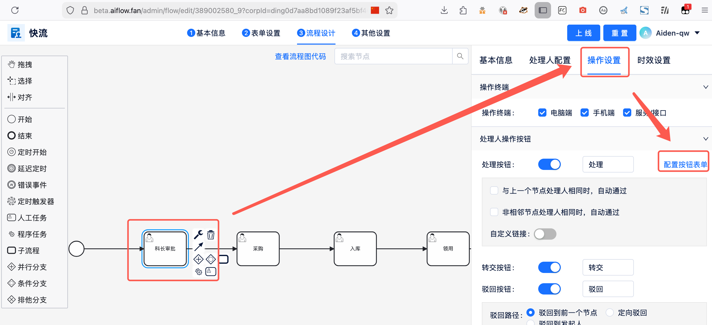
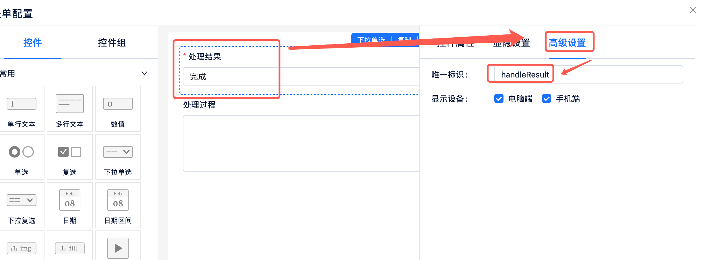

# 配置

在demo目录下，添加.env文件
示例如下：

```angular2html
AIFLOW_DOMAIN="私有化部署的aiflow接口域名，如果使用Saas那么不需要配置此项"
APP_NAME="fastApi demo"
APP_CN_NAME="fastApi例子"
APP_ID="从aiflow后台查询企业的app_id信息"
APP_SECRET="从aiflow后台查询企业的app_id信息"
ENTERPRISE_CODE="从aiflow后台查询企业代码"
SERVICE_DOMAIN="http服务对应的域名地址，需要确保私有化部署或者saas部署的aiflow可以访问到"
```

# 安装依赖

```angular2html
pip install -r requirements.txt
```

# demo用法

## fastapi_demo 启动

在demo目录执行 ```python -m fastapi_demo.demo```
启动后，会自动将添加注解的http服务注册到aflow中，在流程中进行选择调用

## aflow_method_demo 使用

提供了如何调用aflow内置的方法，完成流程相关操作的示例。

### http调用示例

在demo目录执行 ```python -m aflow_method_demo.http_demo```

### client调用示例

在demo目录执行 ```python -m aflow_method_demo.client_demo```

# Handle Flow的接口说明

### 获取元素的唯一标识

在处理节点过程中，需要获取审批节点表单的元素的唯一标识，可以通过以下方式获取。
审批的表单为标准表单，表单中元素的唯一标识可在不同审批节点中重用。


*图1: 通过编辑流程，进入流程设计页，查看审批节点的按钮表单*


*图2: 进入表单，查看指定元素的唯一标识*
